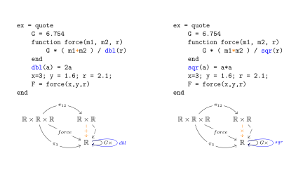

# A Category for Models
$\newcommand{\Ct}{\mathcal{C}}$ Let $\mathcal{C}$ be the category of programs, where
$Ob(\mathcal{C})$ and $Hom(S,T)=\{f \mid f(::S)::T\}$. A model is a subcategory comprised
of functions and types used in the code that implements that model. Then a model
transformation is a function, $t$, on models $M$ that induces a functor $F:t(M) \to M$. We
define the model transformation as function on models because you need to compute it going
from the simple model to the more complex model, but the functor goes the other way, from
the complex model to the simple model.

## Properties of Transformations

Model transformations respect composition.

*Proof:* If $t_1(M)=M'$ there exists $F:M' \to M$ and
$t_2(M')=M''$ there exists $G:M'' \to M'$ then
$t_2\circ t_1$ induces a functor $G\circ F: M'' \to M$ by the definition of functor.

## Examples

A simple model of gravity can be represented. Everyone knows the formula for the force of
gravity, the sum of the masses divided by the double of the radius between them

$$F=G\frac{m_1 + m_2}{2r}$$ 

Oh wait, that isn't right, it has that structure, but is it the sum or the product? And is
twice the radius or the square of the radius?

A model transformation can recover the right model for us. The following figure show $M$
on the left and $M'$ on the right. The functor between them is shown using color.

The functor from $M'$ to $M$ tells us how to transform $M'$ back into $M$. We see that the
only think that changed is $\times$ becomes $+$ and $sqr$ becomes $dbl$. This is exactly
the way a programmer would describe the difference between these two models.

We can see the notion of a fully faithful functor indicating that these models have the
same structure. The functions in these two programs are in 1-1 correspondence. The notion
of fully faithful functors says that for every pair of types $S,T$ $F$ maps
$Hom_{M'}(S,T)$ to $Hom_{M}(F(S),F(T))$ with a 1-1 function. For this case $F(S)=S$ for
all types. So this reduces to $Hom_{M'}(S,T)\to Hom_{M}(S,T)$ with a 1-1 function. Based
on the sizes of the $Hom$ sets, we see that there are only 4 possible fully faithful
functors between these two models. The most obvious one is the one shown with color.

### Isomorphism is too strict
You might think that since these diagrams look like graphs and the functors look like
graph homomorphism, that graph isomorphism is a good definition of "models with the same
structure". But this is two strict.

In the following example the type graphs are not isomorphic, but there is a fully faithful
functor between the model categories.

