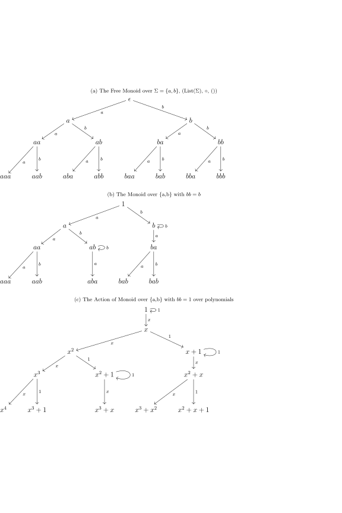

---
header-includes:
  - \usepackage{fullpage}
  - \usepackage{amssymb}
  - \usepackage{amsmath}
output:
    pdf_document
---
# A Category for Models
$\newcommand{\Ct}{\mathcal{C}}$ Let $\mathcal{C}$ be the category of programs, where
$Ob(\mathcal{C})$ and $Hom(S,T)=\{f \mid f(::S)::T\}$. A model is a subcategory comprised
of functions and types used in the code that implements that model. Then a model
transformation is a function, $t$, on models $M$ that induces a functor $F:t(M)\to M$. We
define the model transformation as function on models because you need to compute it going
from the simple model to the more complex model, but the functor goes the other way, from
the complex model to the simple model.

## Properties of Transformations

Model transformations respect composition.

*Proof:* If $t_1(M)=M'$ there exists $F:M' \to M$ and
$t_2(M')=M''$ there exists $G:M'' \to M'$ then
$t_2\circ t_1$ induces a functor $G\circ F: M'' \to M$ by the definition of functor.

## Examples

A simple model of gravity can be represented. Everyone knows the formula for the force of
gravity, the sum of the masses divided by the double of the radius between them

$$F = G \frac{m_1 + m_2}{2r}$$

Oh wait, that isn't right, it has that structure, but is it the sum or the product? And is
twice the radius or the square of the radius?

A model transformation can recover the right model for us. The following figure show $M$
on the left and $M'$ on the right. The functor between them is shown using color.

The functor from $M'$ to $M$ tells us how to transform $M'$ back into $M$. We see that the
only think that changed is $\times$ becomes $+$ and $sqr$ becomes $dbl$. This is exactly
the way a programmer would describe the difference between these two models.

We can see the notion of a fully faithful functor indicating that these models have the
same structure. The functions in these two programs are in 1-1 correspondence. The notion
of fully faithful functors says that for every pair of types $S,T$ $F$ maps
$Hom_{M'}(S,T)$ to $Hom_{M}(F(S),F(T))$ with a 1-1 function. For this case $F(S)=S$ for
all types. So this reduces to $Hom_{M'}(S,T)\to Hom_{M}(S,T)$ with a 1-1 function. Based
on the sizes of the $Hom$ sets, we see that there are only 4 possible fully faithful
functors between these two models. The most obvious one is the one shown with color.

### Isomorphism is too strict
You might think that since these diagrams look like graphs and the functors look like
graph homomorphism, that graph isomorphism is a good definition of "models with the same
structure". But this is two strict.

In the following example the type graphs are not isomorphic, but there is a fully faithful
functor between the model categories.

## A category of models
\newcommand{\Mod}{\mathbb{M}} 

Let $\Mod{}$ represent the category of models under transformation. $Ob(\Mod{})$ is the set
of models and $Hom_{\Mod{}}(M', M)$ is the set of functors from $M'$ to M (ie.
transformations from $M$ to $M'$).

## Perspective on Model Selection

Given an initial model $M$ a set of morphisms in $\cup_x Hom_{\Mod}(M,x)$ we want to pick
the $m$ that minisimizes some function $\ell(m)$ which is the loss between the data and
the model $m$. Suppose that $T=\langle T_i \rangle$ is the set of transformations
generated by $\{T_i \mid i \in \mathcal{I}\}$. We want to derive model selection algorithms
that work for any $M,\ell,T$.

These algorithms will exploit the algebra of the transformation set, for example if the
set of transformations is just a compositional monoid then the only option is to enumerate
the tree of possible transformations $(List(T), ++, [])$ and pick the one that minimizes
the loss. If the transformations have a stronger structure, such as forming a ring, and
that structure is compatible with respect to the loss function, we should be able to find
algorithms that exploit that structure.

The free monoid over $k$ elements induces a $k$nary tree of strings. Other finitely
generated monoids induce rooted
directed graphs that are not trees. The graph is defined by the recurrence $v_1 = 1$ and
$N(v) = \{t\circ v \mid t \in \{T_i\}\}$. Multiple paths in this graph correspond to the
fact that each element in the monoid may be factored into multiple combinations of the
generators. 

For model selection, we want to choose representations of the transformation monoid that
\emph{respects} the loss function that we are trying to minimize for example, knowing that
for all $u \in N(v)$, $\ell(u) \leq \ell(v)$ would provide you with a tool for designing
algorithms on these trees. In the worst case, exploration of this graph would require a
complete search in order to find the minimum of $\ell$, this is an exhaustive search of
the transformation space. We want to build representations of the transform monoid that
allow for a faster search than exhaustion.
