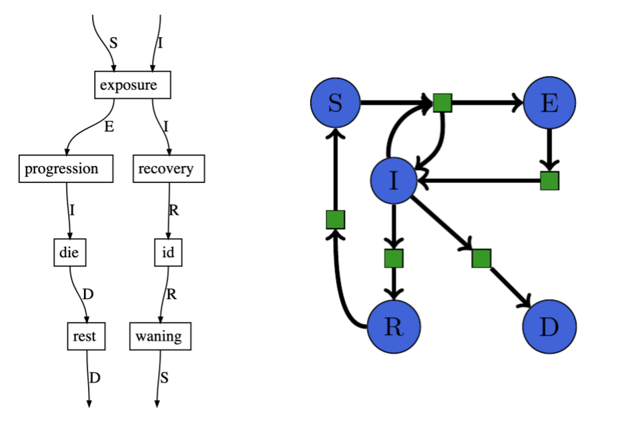

# Semantic Modeling Theory

## What is a model?

The goal of science is to build models of natural phenomena that explain the world.
Scientists build these models by conducting data gathering phenomena and using math to represent these experiments.
This sets up a balancing act between the two traits that make for a good scientific model,
it must first match the data collected and also be able to explain the phenomena.

We can think of fitting the data as a regression problem:

$$h^* = \min_{h\in {H}} \ell(h(x), y)$$ and the institutional process of discovery as

$$\max_{{H}\in \mathcal{M}} expl(h^*)$$ where $expl$ is the explanatory power of a class of models $H$. The explanatory
power is some combination of generalization, parsimony, and consistency with the fundamental principles of the field.

This formulation is notional in the current state of the art, because models are not a well parameterized space.
The goal of this project is to identify subspaces that can be parameterized using algebraic structures and represent
those subspace symbolically so that computers can represent them and perform optimization over model structure in
addition to model parameters.

The philosophy of science
[Kuhn 1962](https://en.wikipedia.org/wiki/The_Structure_of_Scientific_Revolutions)
tells us that scientists don't make models in a vacuum, they are usually working
within a scientific paradigm. These paradigms are often given names like
"Newton's Theory of Classicial Mechanics" or "Einstein's Theory of General
Relativity". Within these *theories*, specific scenarios are explained with
*models* which instantiate the theory. While in scientific practice there are
many types of theories, some more mathematical than others, we will focus on
modeling frameworks as implementations of scientific theories and the models you
can build within a framework as implementations of scientific models within that
theory.

### Modeling Frameworks as a Paradigm of Paradigms
Computational Science is a scientific discipline concerned with the interaction
of computations, mathematics, and domains science and thus, must have a paradigm
of its own. In the pre-paradigm phase scientists just wrote Fortran programs to
make their models and would have been unable to articulate a theory of which
programs constitute a class of models. The dominant paradigm currently is the
modeling framework, where a small group of scientists write a library or design
a programming language for expressing all possible models within a scientific
domain and then a larger group of scientists use the library in diverse
experimental or theoretical contexts. The rules of the domain are a \"scientific
paradigm\" and the modeling framework is an implementation of it in software.

####  History of the Modeling Framework Paradigm

When scientists were first given access to computers, they wrote
programs directly and every scientist doing computational work
needed to write FORTRAN programs in order to implement their ideas.
This worked for a while until the complexity of the algorithms
needed to solve models on increasingly complex hardware exceeded the
ability of scientists to become an expert in both the scientific
domain and computer programming. Thus, the first modeling languages
were born. Tools like MATLAB and Mathematica allowed scientists to
learn a programming language that hid the complexity of computer
programming from them and allowed them to focus on their domain
knowledge and model construction.

Modeling languages more tightly coupled to the scientific discipline
achieved great success. This includes Stan for Bayesian models,
Simulink for signal processing with dataflow programs, and AML for
algebraic modeling of optimization problems.

This paradigm flourished from the late 1970s until modern systems.
The flaws in the monolithic modeling language were exposed by
software libraries embedded in fully featured programming languages.
Python and R for scientific modeling and statistical modeling
respectively after the late 2000s. As the models grew in complexity
and the scientific workloads became more data driven, scientists had
to do more diverse computing tasks such as downloading and cleaning
data from websites, interacting with network APIs, and managing
large data files.

The frameworks have been able to succeed because they separate
concerns, the implementers of the framework carve out a space of
scientific computing to address (for example signal flow graphs or
finite element simulations) and implement the mathematical
algorithms of that scientific domain. The frameworks closely match
the underlying scientific paradigms that they implement. Then the
modelers can proceed in what Kuhn calls, *normal science* whereby
they make and interrogate models within the framework. When the
modelers get to the point were the framework cannot handle their
problems (a *crisis*) they expand the framework or write a new one.

1.  Connections to Algebraic Theories

    Mathematical Reasoning has been the dominant paradigm of
    mathematics since Descartes and over the centuries various
    subfields of mathematics have undergone crises and paradigm
    shifts such as the early 20th century revolutions of formal
    logic, the everyday practice of modern mathematics would be very
    familiar to the early modern scholars.

    In the field of Algebra, the study of mathematical structure,
    there are various *theories* that represent different types of
    mathematical structures. For example, *groups* represent systems
    of multiplication with identity, and *rings* are systems of
    addition and multiplication that respect a distributive law. The
    algebraic theory provides for a types of elements and tuple of
    operations that must satisfy some equations. Each theory of
    algebra is a different type of number system that can be used
    for multiple scientific and engineering applications. Within a
    theory of algebra, there are *models* that instantiate the
    theory with specific sets of elements and specific operations
    that satisfy the equations. Practitioners of algebra study both
    the theory in general and specific models in particular. Thus
    theorems in group theory come primarily in two varieties, \"let
    G be a group ...\" or \"let $D_n$ be the dihedral group on $n$
    points\" and then go on to state a consequent either for the
    theory or the named models.

2.  What is a Framework?

    Software modeling frameworks are similar, in that they define a
    theory of possible models that can be implemented with the
    framework, and provide algorithms for answering queries about
    those models. Since modeling frameworks are often built out of
    programming languages in an *ad hoc* manner, they suffer flaws
    of design. We propose two criteria for evaluating the quality of
    a modeling framework:

    1.  **correctness**, the framework can represent all models
        within the domain paradigm it purports to implement, and
    2.  **efficiency**, the framework provides efficient solvers for
        real world problems of "normal science" within that
        paradigm.

    Such software then *implements* a scientific paradigm. The scope
    of a paradigm is determined by the practitioners of the field.
    The community of users of a framework together form a discipline
    of scientific computing. A good modeling framework should have a
    tight correspondence to a specific mathematical or scientific
    theory. For example a system for modeling chemical systems
    should use a syntax similar to the reaction network equations of
    modern chemistry and be able to efficiently compute equilibria
    and dynamics of complex chemical systems.

    Some frameworks are so broad that they seem to span multiple
    paradigms. For example, the modeling framework MATLAB defines
    its scope as numerical computing, which is so broad so as to
    seem all encompassing. Since existing modeling frameworks
    developed organically in response to the needs of practical
    scientists and engineers, they have unclear and disputed
    boundaries not unlike borders on a map of unexplored territory.
    Typically, the closer a domain specific modeling language
    matches the domain it implements, the more powerful the tools
    for analyzing the models, at the other end of the spectrum are
    general purpose programming languages, which can express any
    computable model, but cannot provide insight in a structured
    way. One goal of computational science and engineering is to
    provide formal constructions of modeling frameworks given a
    formal definition of a scientific paradigm.

#### Problems in the Modeling Framework Paradigm

As the complexity of our models grows and the diversity of our analysis of the
model increases, the modeling framework paradigm faces growing problems. The
acute problems of the domain are:

  Problem                          Attempted Solutions
  -------------------------------- --------------------------------------------------------------------
  Efficient Simulation of Models   Auto Parallelizing Compilers
  Correctness V&V                  Unitful Quantities and Type Systems
  Model Fusion                     Networking protocols and API standardization
  Model Selection                  Parameterizing the space of models and applying genetic algorithms
  Data Driven Modeling             Replace deterministic components of models with ML models
  Parameter Estimation             Gradient free optimization, approx bayesian computing, autograd
  Optimization                     Auto differentiation through programs

###  The Computational Science of the Future

While scientists have been using framework driven computing for
decades, mathematicians have been unifying the two great pillars of
modern mathematics -- Analysis, the mathematics evolved from
differential and integral calculus, and Algebra, the study of
mathematical structure. This grand unified theory is Category
Theory, which was developed to unify Algebraic Topology, but has
recently found direct application to the analysis of scientific
systems.

Scientific theories like the chemical reaction networks of Petri are
amenable to formalization and explanation as categories, where the
algebraic and analytic structures are made explicit. With applied
category providing a new generation of applied mathematics to
understand scientific phenomena, and the deep connection between
category theory and functional programming, a new generation of
scientific software can be developed.

#### Software that understands science

Just as the structure of the modeling framework forces the modeler
to stay within the paradigm, ACT based modeling software will
provide structure to the programs written by scientists. The benefit
of ACT based software is that the paradigmatic rules will be made
explicit. They set of objects in a category define the scope of
concepts that can be included in a model, and the set of primitive
morphisms define the possible relationships between those concepts.
Thus by specifying a category, you explicitly construct the *rules*
of the modeling paradigm.

Once made precise, this structure can be exploited by algorithms
that understand the modeling framework. Modeling frameworks that
form a monoidal category provide for combination of models by
sequential and parallel composition. Modeling frameworks that form
an adhesive category provide also the structure of double pushout
(DPO) rewriting, which enables reasoning over *model space* by
analogy.

In order to say that algorithms *understand* models, we must
operationalize a definition of understanding.

1.  **Rejection of ill-formed models**: any modeling framework
    defines a scope of possible models and must be able to detect a
    program that specifies a model outside that scope. Scientists
    use a lay type system when checking formulas by hand. This type
    system gives all quantities a *sort* which allows them to check,
    \"this formula doesn\'t make sense, because it combines two
    numbers of different sorts\". For example unit-checking is a
    form of type checking that rejects mechanical models that add
    quantities with different units, such as $5m + 3m/s$. Any
    modeling framework worth using must have the ability to
    recognize well formed models.

2.  **Explanation of model differences**: a human scientist can see
    multiple scientific models and describe the differences. For
    example \"the heat equation on a square surface with Dirichlet
    boundary conditions\" differs from \"the heat equation on a
    circular surface with von Neumann boundary conditions\" in both
    *surface shape* and *boundary conditions* aspects. Scientists
    working within a common paradigm have a similar
    conceptualization of these aspects and how models inhabit them,
    even if they do not have a formal system of describing these
    aspects. An algorithm that understands models should be able to
    explain such differences when presented with similar models.

3.  **Comprehension of model neighborhoods**: a useful technique for
    model construction is to take an existing model from the
    literature and perturb it into a novel model that is adapted to
    the current experimental or observational context. An algorithm
    that understands models should be able to provide novel models
    that are in the *neighborhood* of any given model.

These three types of model comprehension are interlinked. The
rejection of ill-formed models (or recognition of well-formed
models) defines a scope of all possible models that is used in
framing the explanation of model differences and comprehension of
model neighborhoods. To describe model differences in terms of
aspects is one way to parameterize model neighborhoods and then
specify the relative location of two models within the implied
topology.

#### New Problems

If computational science is to be thought of as a discipline in its own right,
it must have content beyond, "the parts of applied math and computer science
that are useful to scientists." We can outline several problems of interested
within this discipline.

1.  **Modeling Framework Construction**: Given a definition of the scientific
    theory as a category, generate a domain specific language for expressing
    models within that theory. Such models should be easy to write and the
    system should retain enough of the problem structure to execute solution
    algorithms.

2.  **Modeling Framework Analysis**: Given a DSL and solver algorithm, derive a
    presentation of a category. This is the inverse problem of the modeling
    framework construction problem.

3.  **Compositional solvers**: If the modeling framework is compositional, for
    instance based on monoidal categories, then the solution to scientific
    queries about that model should be compositional. Any property of the model
    should be able to be computed based on the properties of its components. For
    example, a chemical equilibrium of two independent systems is a combination
    of the equilibria of the two component systems. Numerical solution
    algorithms that exploit this compositional structure of the models should be
    faster or more accurate than naive techniques. The development of
    compositional solvers should alleviate the crisis of complexity presented by
    multiscale and multiphysics simulations.

4.  **Universal data structures for partially symbolic computing**: Given
    intimate connections between applied category theory and diagrammatic
    languages, there should be universal data structures for representing
    models. For example in any monoidal category, there is a system of wiring
    diagrams that can be used to draw morphisms. Algorithms for analyzing models
    that are built on manipulations of these data structures will be universal
    across modeling frameworks. By developing algorithms that work with models
    from multiple frameworks, we can make leverage increasingly sophisticated
    algorithms while proliferating frameworks to every area of science.

5.  **Automated Metamodeling**: A lot of scientific activity involving models
    involves higher order functions on models. Model selection is a process that
    takes a class of models and a data set and returns the best model from the
    class given the data. Sensitivity analysis and uncertainty quantification
    are modeling activities that take a model and provide another model that
    computes the sensitivities or uncertainties of the given model. Once
    algorithms can be built that understand the rules of a scientific paradigm,
    these metamodeling activities can be automated

6. **Model Fusion**: Given models in two different frameworks, design and
   implement an interface that allows you to combine those two models in a
   meaningful way.

## Categories for Science

Dan Spivak wrote a wonderful book, [CT4S](http://math.mit.edu/~dspivak/CT4S.pdf),
on category theory for scientists based on his lectures at MIT.

> Data gathering is ubiquitous in science. Giant databases are currently being mined for unknown
> patterns, but in fact there are many (many) known patterns that simply have not been catalogued.
> Consider the well-known case of medical records. A patient’s medical history is often known by
> various individual doctor-offices but quite inadequately shared between them. Sharing medical
> records often means faxing a hand-written note or a filled-in house-created form between offices.
>
> Similarly, in science there exists substantial expertise making brilliant connections between
> concepts, but it is being conveyed in silos of English prose known as journal articles. Every
> scientific journal article has a methods section, but it is almost impossible to read a methods
> section and subsequently repeat the experiment—the English language is inadequate to precisely and
> concisely convey what is being done


This is the point of our project, to mine the code and docs for the information necessary to repeat
and *expand* scientific knowledge. Reproducible research is focused on getting the code/data to be
shared and runnable with VMs/Docker etc are doing the first step. Can I repeat your analysis? We
want to push that to expanding.

### Ologs

Ontology logs are a diagrammatic approach to formalizing scientific methodologies. They can be used
to precisely specify what a scientist is talking about (see [Spivak, Kent 2012](https://journals.plos.org/plosone/article?id=10.1371/journal.pone.0024274) "Ologs: A Categorical Framework for Knowledge Representation.").

An olog is composed of types (the boxes) and aspects (the edges). The labels on the edges is the
name of the aspect. An aspect is valid if it is a function (1-many relation).


We can represent an SIR model as an olog as shown below.


Another category theory representation without the human readable names used in an olog shows a simpler representation.


## Models in the Category of Types

All programs in a strongly typed language have a set of types and functions that map values between those types.
For example the Julia program

```julia
a = 5.0
b = 1
c = 2*a
d = b + c
```
Has the types `Int, Float` and functions `*, +` which are both binary functions. These types and functions can be
represented as a category, where the objects are the types and the morphisms are the functions. We refer to the input
type of a function as the domain and the output type as the codomain of the function. Multi-argument functions are
represented with tuple types representing their argument. For example `+(a::Int,b::Int)::Int` is a function $+:
Int\times Int -> Int$. These type categories are well studied in the field of Functional Programming. We apply these
categories to the study of mathematical models.

One can use a combination of static and dynamic analysis to extract this category representation from a program and use
it to represent the model implemented by the code.

The most salient consequence of programming language theory is that the more information that a programmer can encode in
the type system, the more helpful the programming language can be for improving performance, quality, and correctness.

We want to leverage the type system to verify the semantic integrity of a model. This is critical when pursuing
automatic model modification. Model developers use any number of conventions to encode semantic constraints into their
code for example, prefacing all variables that refer to time with a `t`, such as `t_start, s_end`. This semantic
constraint that all variables named `t_` are temporal variables is not encoded in the type system because all those
variables are still floats. Another example is that vectors of different lengths are incompatible. In a compartment
model, the number of initial conditions must match the number of compartments, and the number of parameters may be
different. For example in an SIR model there are 3 initial conditions, $S,I,R$ and there are 2 parameters $\beta,
\gamma$. These vectors are incompatible, you cannot perform arithmetic or comparisons on them directly. Most
computational systems employed by scientists will use a runtime check on dimensions to prevent a program from crashing
on malformed linear algebra. Scientists rely on this limited from of semantic integrity checking provided by the
language.

Our goal is to extract and encode the maximum amount of information from scientific codes into the type system. The type
system is analyzable as a category. Thus we can look at the category of types and analyze the integrety of the programs.
For example if there are two types $S,T$ and two functions $f,g: S\rightarrow T$ such that $Codom(f) = Codom(g)$ but
$Range(f) \cap Range(g)$, then we say that the type system is ambiguous in that there are two functions that use
disjoint subsets of their common codomain. In order to more fully encode program semantics into the type system, the
programmer (or an automated system) should introduce new types to the program to represent these disjoint subsets.

Returning to the SIR model example, the `.param` and `.initial` functions both map `Problem` to `Vector{Float}` but have
disjoint ranges. From our mathematical understanding of the model, we know that parameters and initial conditions are
incompatible types of vectors, for one thing the output of `.param` is length 2 and the output of `.initial` is
length 3. Any program analysis of the model will be hampered by the ambiguity introduced by using the same type to
represent two different concepts. On the other hand, `.first` and `.second` have overlapping ranges and are comparable
as times.


This is an example of how PL theory ideas can improve the analysis of computational models.

Teaching the type system about agent based modeling. In the example notebook `/examples/agenttypes2.jl` you can see how
to embed model structure into the julia type system. That example uses two versions of the same agent based model of
disease. In the first implementation, the agents have states represented by the julia type `:Symbol` with values `:S,
:I, :R`, and in the second, more refined implementation, the agent's states are represented by the singleton types
`Susceptible, Infected, Recovered` with values, `Susceptible(), Infected(), Recovered()`. The model is the same, but the
type system contains more information about the execution of the model. For example the julia type system knows what the
possible state transitions are based in the second implementation, while the first model has a black box of `:Symbol`s
that are not distinguishable in program analysis.

The original type graph $g$ shows how the model works.


The refined model has a typegraph $G$, which includes the new singleton types as well as different tuple types.

We can establish a graph homomorphism $\phi: G \to g$ such that $\phi(v) = v$ for all $v$ in $V(g) \cap V(G)$.
The following figure shows this homomorphism by drawing vertices $v\in G$ with the same color as $\phi(v)\in g$.

Within this typegraph we have a subgraph that contains the state transitions for the agents. We can draw this subgraph
separately to show how the compiler has been taught to understand the semantics of the model.


The embedding of model semantics into the type system enables programs to reason over the behavior of the models.

# Theoretical Understanding of Modeling

Models are mathematical objects that behave like functions, but are not well
captured by the ordinary definition of mathematical function. They are also not
captured by programming language functions or subroutines. Mathematical
functions only care about the association between input and output values of the
function, and programming languages are concerned with troublesome implementation
details. We need a representation of models that is aware of the internal
structure of the model, but also captures the functional nature. We
also think of models as representing systems, and a fundamental property of
systems is that you can compose them to get complex systems out of simples ones.

Category Theory (CT) generalizes the notion of sets and functions to discuss
*objects* and *morphisms*. In our notation, a modeling framework corresponds to
a category, and the models that you can express in that framework are the
morphisms in that category.

Monoidal Categories are Categories that have two types of composition
($\circ, \otimes$), the first corresponds to sequential processes and resembles
the function composition. The second, represents parallel or independent
combination of two models.

1. Objects: $W,X,Y,Z$
1. Morphisms: $f:X\rightarrow Y$, $g:Y\rightarrow Z$
1. Composition: $g\circ f = fg:X\rightarrow Z$
1. Combination: $f:X\rightarrow Y, g: W\rightarrow Z$ implies $f\otimes g:
   (X\otimes W) \rightarrow (Y\otimes Z)$

In this language we call the objects *domains*, the morphisms *models*.
Composition is feeding the output of one model as the input to another, and
$f\otimes g$ is parallel or independent combination of $f$ and $g$. There are
equations for $\circ, \otimes$ like associativity that are necessary to show
that $\circ, \otimes$ respect each other. We consider each Monoidal
Category (MC) to be an example of a modeling framework. Many existing areas of
mathematical modeling were developed as MCs without knowing it, because the
idea of composition and combination are very natural for decomposing physical
systems into their component parts.

## Examples of Modeling Frameworks

The following mathematical modeling frameworks are both widely used in science
and engineering, and are examples of Monoidal Categories.

1. Petri Nets (Figure 1)
1. Bayesian Networks (Figure 2)
1. Matrices and Linear Algebra
1. Dataflow programs used in Signal Processing
1. Controls Algorithms
1. Machine Learning Workflows
1. Neural Networks
1. Models of Quantum Computation




MCs provide you with a universal syntax called *wiring diagrams*.
`SemanticModels.jl` uses a Julia package developed by E. Patterson at Stanford
called `Catlab` to represent these wiring diagrams. Wiring diagrams provide a
syntax to the modeling framework, in that one can express every model in the
language of $\circ, \otimes$ and a list of primitives. Since we are in the world
of computation, we are concerned primarily with finitely presented MCs which
have a finite set of primitives.

In order to compute with a modeling framework, it is essential to give the
modeling framework a *semantics*, which means a functor from the set of wiring
diagrams to some formulation that can be turned into a program. For example,
Petri Nets are just multigraphs with attached metadata, that need to be
converted into Differential Equations or Stochastic Discrete Event Simulators in
order to model chemical or biological processes. Once you have this
representation, you need to generate a program that solves those equations. We
consider this the core of a modeling framework:

1. you have an MC for describing models,
1. a functor that converts it to a structured knowledge representation, and
1. a code generation platform for creating executable code.

## Double Pushout Rewriting

The Category Theory community has been working on understanding
rewriting systems in mathematics for several decades, but the most directly
applicable work has been done in the last 5 years by John Baez group at UC
Riverside. Daniel Cicala wrote a dissertation published in May 2019 on rewriting
systems for Open Systems like Petri Nets.

*Double pushout rewriting* is a process of making analogies between systems for
specifying transformations on those systems. Originally developed for
transforming graphs according to rules, DPO rewriting has been extended to
arbitrary *topoi*. Figure 3 shows an example of graph rewriting that says
*delete a loop* and then applies that rule to another graph.


## Model Augmentation in Category Theory

There is a mathematical structure called a lens that solves a hard problem in
functional programming. Given a large and complex data structure, how do you
manipulate a small part of it in a way consistent with the overall structure? In
data processing you can think of running an SQL query to create a view,
modifying rows in that view, and having the database state reflect those changes
in the underlying tables. Lenses are a mathematical object for representing this
situation in software engineering.

Model augmentation fits this mathematical structure perfectly. The complex data
structure is the code found in a modeling program, and the view is the small
fraction of that code that represents the scientific model. Augmenting a model
inside a code corresponds to a lens where we extract the model, change it, and
then update the code to be consistent with our changes. Figure 4 depicts the
relationship between lenses and model augmentation within SemanticModels.


`SemanticModels.jl` currently implements model augmentation by combining lenses with
MCs to extract a model from the code, apply *double pushout rewriting*, and then
updating the code to reflect this new model. The *lens laws* require that
transformation is composable with nice mathematical properties, thus making the
system amenable to mathematical analysis. Over the coming months we will advance
both the analysis of our system and its capabilities to operate on more diverse
codes and models.

# Partially Symbolic Computing

We are using `ModelingToolkit.jl` which provides an embedded *computer algebra
system (CAS)* to represent computations as data. This software has matured
during the first phase of ASKE, and is now ready for routine use. Working with
ModelingToolkit expressions is easier than working with Julia expression trees
primarily because there are no conditional or iterative structures such as if
statements or for loops. We believe that embedded CAS will change how scientific
software is developed over the next 10 years.

In general purpose computing, the task of generating fast code falls to
compilers and is performed using general purpose techniques for code
optimization. However, in scientific computing, this task is performed by highly
skilled mathematicians, scientists, and engineers because the need for high
performance code is so great and the complexity of the systems is so high.
Scientific computing is characterized by specialists using their mathematical
and scientific talent to write code faster than what a compiler can possibly
produce because they know something special about the problem they are trying
to solve. Examples such as the Fast Fourier Transform show what heroic effort on
the part of scientific computing that specialists can produce.

As these techniques go from highly specialized one-off tricks to general purpose
techniques that can apply to many problems, they will be automated. This
automation requires symbolic understanding of what the program is trying to
compute. There are many opportunities for performance and accuracy improvements
that can be exploited by computational techniques that have access to the
mathematic representation of a problem for symbolic computing. Now that high performance
dynamic code generation is a viable technology, the time is ripe for embedded
CAS based modeling frameworks. These frameworks will take a data structure that
represents the symbolic mathematics that the scientist wants to solve, and
generate special purpose code for that problem on demand.


Our Petri Net framework (Figure 5) is based on partially symbolic computing and
uses an embedded CAS to represent the structure of the Petri Net. When it is
time to solve the model, we dynamically generate code for Differential
Equations, or Stochastic Discrete Event Simulation based on the symbolic
expressions. Model Augmentation operates on the symbolic formulation, which is
much easier to work with than general purpose code, but compiles down to
straight-line procedural code with no generic code overhead. Thus we get the
benefit of a custom implementation of each Petri Net, without the labor
intensive work of writing the code each time. A benefit of this approach is that
no one needs to write a general simulator that can simulate any possible system.
You only need to write a code generator that given a specific system, generates
a simulator for that specific system. We believe that this is an easier task
than writing a single simulator that is simple, concise, general, and efficient.
This is because the majority of software complexity in scientific computing
comes from pushing the Pareto frontier of $\text{concise} \times \text{general}
\times \text{fast}$. A code generator can completely abandon the requirements of
concise and general code, and thus has liberty to write code that is simple and
fast. The code generator must be concise and general, but does not need to be
fast. By reducing the problem to writing a general code generator that generates
specialized code, one can avoid high complexity scientific software.

The experience of writing a Petri Net modeling library illustrates the benefits
of designing the modeling software around symbolic expressions, without
implementing the entire modeling framework in a pure CAS like Mathematica. Model
Augmentation requires the manipulation of the modeling code. If that code is
explicitly represented as lists of symbolic expressions, these manipulations are
easier than manipulating either abstract syntax trees (traditional
metaprogramming) or run-time data structures that configure the model (typical in
dynamic programming languages). An embedded CAS allows you to manipulate
modeling expressions in the familiar language of mathematics and then generate
the efficient code for implementing those formulas. Since code is more complex
than formulas, it is beneficial to program at the level of formulas if possible.

We intend to continue pushing this partially symbolic computing agenda through
additional frameworks such as Bayesian Networks and statistical analysis.

## Semantic Representations of Data Science Programs

The work of Evan Patterson on building semantic representations of data science
programs is particularly relevant to these modeling questions
[SRDSP](https://www.epatters.org/assets/papers/2018-semantic-enrichment-ijcai-demo.pdf "Semantic Representations of Data Science Programs").
[Patterson 2018](https://www.epatters.org/assets/papers/2018-semantic-enrichment-kdd.pdf "Teaching machines to understand data science code by
semantic enrichment of dataflow graphs")

## Model Augmentation

Scientists build novel models from old models and the approach provided by SemanticModels has several benefits. We think
that

### Abstraction

Modeling operations have similarities across domains and we can build general model augmentations that let scientists
translate operations from one domain to another. The code that defines transformations is also "general modeling code"
so our abstraction is closed.

### Symbolification

The geometric perspective is really great for proving things about shapes, but developing algorithms requires adopting a
symbolic perspectrive like algebra. Our example of polynomial regression connects here because we are able to write
algorithms for model selection that leverage the symbolic nature of the transformations. In fact we can give examples of
model selection in terms of [ideals](https://en.wikipedia.org/wiki/Ideal_(ring_theory)). The algebra of the
transformation space is a place for algorithms on the model space.

- Open question: Can we lift the greatest common divisor of polynomials to be the "greatest common submodel" for least
  squares regression? If so, does the euclidean algorithm for GCD give a model selection algorithm?

### Metaprogramming for Science

Scientific models are so diverse that we need the full flexibility of code as input for our modeling framework. This is
somewhat inherent to the scientific process. Scientists who are pushing the field in modeling are often inventing or
applying new algorithms that are capable of solving those models. Also the first formulation of a new model is not the
most elegant and so we need to be able to operate on ad-hoc models before we understand the class of models well enough
for an elegant formulation to get added to the modeling framework.

Metaprogramming is about writing programs that write programs, so it makes sense that metamodeling is about writing
models that write models. In order to write models that can generate models, there needs to be a compact and
parsimonious representation of the model for algorithms to manipulate. As we have seen in writing our post-hoc modeling
framework, scientific models diverse and hard to summarize, however the transformations that can be applied to a model
while preserving its validity within the class of models is often much more structured than the models themselves. This
is why we think that metamodels will work on these transformations instead of on the models directly.

Again we look to our polynomial regression problem, with only two transformations you can generate the entire class of
polynomial regression problems from a model that computes linear regression. Algorithms that work on the polynomial
regression models directly would have to manage a lot of complexity around arguments, data flow, conditional logic, I/O.
But in the transformation state there is just `f(x) -> xf(x)` and `f(x) -> f(x) + 1` which are simple transformations.

By representing complex models as transformations of a base model, under an algebra of transformations, we are able to
make metaprogramming for science much easier.

### Scientific Workflows and Model Synthesis

One goal of the program is to get to the point where we can automatically infer how to combine models based on what they
compute. The idea of model circuits based on signal flow graphs (see #137) is that you can statically connect models
with a wiring diagram and then evaluate the diagram to compute the combined model. General DAGs are hard to compose and
are typically written with either a declarative DAG language or an imperative DAG building library. The complexity of
using DAG driven workflows reveals how the existing implementations lack compositionality, (how can you compose two makefiles?).
By redesigning scientific workflow tools around categories of PROPS, we can achieve higher compositionality and thus more scalable
scientific workflow tools.

[Fong and Spivak 2018](http://math.mit.edu/~dspivak/teaching/sp18/7Sketches.pdf) shows how to express signal processing
and controls problems in a graphical language based on categories of products and permutations category or _props_.

In this category, computations can be specified with diagrams. The following figure shows a diagram representing a
classical controls problem. These diagrams are shown to have the same functorial semantics as matrices.


We think that the category theory approach of props is the right approach. This approach leads to diagrams with precise
semantics for representing general purpose computation networks. These networks will be specified with code that
combines the sum and product operation in a hierarchical expression just like regular code. Thus the code that makes the
diagrams is a model that we can augment with our current Model Augmentation techniques.

These "model circuits" can thus be built out of code resulting from transformations on code that builds a base circuit.
Which establishes tools for creating high level transformations on circuits. We can then define the input and output
wires as the modeling concepts we know and want to know and then build algorithms for solving for the circuit that gets
from the inputs to the outputs. We suspect a dynamic programming approach to recursively bring the inputs and outputs
closer together will solve this problem.

Algorithms that do model synthesis will need to account for the conceptual knowledge that is captured in the text and
documentation of scientific software.

Once we have a mathematically sound way to represent combinations of models, we must address the practical aspects of
model synthesis. We are endeavoring to augment and automate scientific workflows by meaningfully pruning the set of
possible metamodels. When scientists design models, they must confront:

1) known unknowns: parameters or components they are aware of, but about which there may be uncertainty regarding
values or best practices

2) unknown unknowns: parameters or components the scientist does not yet know about, or deems unnecessary for the
current modeling task

In a broader/more abstract sense, our potential contributions to "AI for Science" are related to [uncertainty
quantification](https://en.wikipedia.org/wiki/Uncertainty_quantification), and we endeavor to help scientists assess and
reduce both aleatoric and epistemic uncertainty. By working within a specific domain and comparing known existing
models, we can help a scientist make progress on (1). By integrating across domains at semantically meaningful
endpoints, we can help a scientist make progress on (2).

Some tasks that can be automated require understanding both the existing scientific software ecosystem and what the
scientist it trying to compute. For example, scientific productivity can be enhanced by answering questions like, "If
I know X and Y but want to know Z, what software tools can solve this for me, and how do I use them?" This is a task
that _de novo_ modeling frameworks cannot answer, because the existing literature was not developed with the new
framework.

## Up Next

The ideas of representing models as categories and functors that preserve different aspects of the structures we have is
compelling. We believe this is the best theoretical foundation for the model augmentation and model synthesis components
of SemanticModels.
