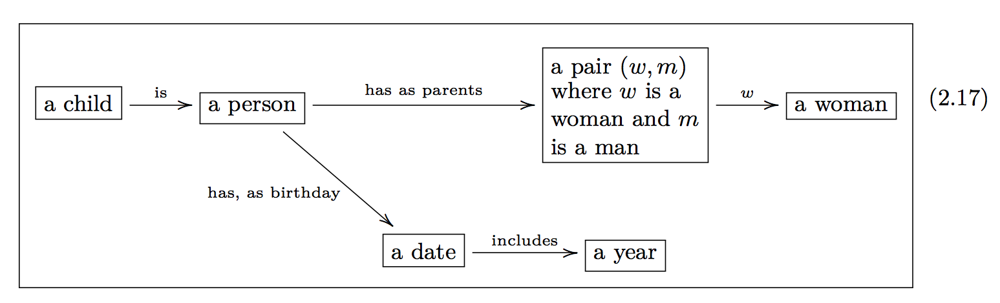

# Semantic Modeling Theory

## What is a model?

The goal of science is to build models of natural phenomena that explain how they work.
Scientists build these models by conducting data gathering phenomena and using math to represent these experiments.
This sets up a balancing act between the two traits that make for a good scientific model, 
it must first match the data collected and also be able to explain the phenomena.

We can think of fitting the data as a regression problem:

$$h^* = \min_{h\in {H}} \ell(h(x), y)$$ and the institutional process of discovery as

$$\max_{{H}\in \mathcal{M}} expl(h^*)$$ where $expl$ is the explanatory power of a class of models $H$. The explanatory
power is some combination of generalization, parsimony, and consistency with the fundamental principles of the field.

This formulation is notional in the current state of the art, because models are not a well parameterized space.
The goal of this project is to identify subspaces that can be parameterized using algebraic structures and represent
those subspace symbolically so that computers can represent them and perform optimization.

## Analyzing scientific models as programs
We can consider three different problems for semantic modeling

1. *Model Modification:* Given a model $M$ and a transformation $T$ construct a
   new model $T(M)$.
2. *Metamodel construction:* Given a set of a possible component models
   $\mathcal{M}$, known independent variables $\mathcal{I}$, and a set of
   desired dependent variables $V$, and a set of rules for combining
   models $R$construct a combination of models $m\in\mathcal{R(M)}$ that takes
   as input $\mathcal{I}$ and evaluates the dependent variables $V$.
3. *Model Validation:* Given a model $M$ and a set of properties $P$ and input
   $x$, determine if the model satisfies all properties $P$ when evaluated on
   $x$
   
A model $M=(D,R,f)$ is a tuple containing a set $D$, called the domain, and a
set $R$, called the co-domain with a function $f:D\mapsto R$. If $D$ is the cross
product of sets $D_1 \times D_2 \cdots D_k$ then the and $f = f(x_1\dots x_k)$
where $x$ are the independent variables of $M$. If $R=R_1\times R_2\cdots r_d$
then $R_i$ are the dependent variables of $M$. 

A Modeling framework $(U,M,R)$is a universe of sets $U$, class of models
$\mathcal{M}$, and a set of rules $R$. Such that the domains and co-domains of
all models in $\mathcal{M}$ are elements of $\mathcal{U}$, and the class of
models is closed under composition when the rules are satisfied. If $R(M_1,
\dots M_n)$ then $\circ\left(M_1\dots M_n\right)\in \mathcal{M}$. Composition of
models is defined as 

$$\circ(M_1, \dots, M_n)=(D_1\times\dots\times D_{n-1}, R_1\times\dots\times R_{n-1}, \circ (f_1(x_1),\dots f_{n_1}(x_{n-1}))$$ 

In order to build a useful DAG, a class of models should contain models such as
constants, identity, projections, boolean logic, arithmetic, and elementary
functions.

We also need to handle the case of model identification. There are certain
models within a framework that are essentially equivalent. For example if $D_1$
and $D_2$ are sets with homomorphism $g:D_2\mapsto D_1$, then $M_1 = (D_1, R, f)
= (D_2, R, f \circ g)$ are equivalent as models. In fact $(D_2, D_1, g)$ should
be included in the class of models in a modeling framework.

We need a good theoretical foundation for proving theorems about manipulating
models and combining them. Categories for Science may be
that foundation.

The work of Evan Patterson on building semantic representations of data science
programs is particularly relevant to these modeling questions
[SRDSP](https://www.epatters.org/assets/papers/2018-semantic-enrichment-ijcai-demo.pdf "Semantic Representations of Data Science Programs").
[Patterson 2018](https://www.epatters.org/assets/papers/2018-semantic-enrichment-kdd.pdf "Teaching machines to understand data science code by
semantic enrichment of dataflow graphs") 

## Categories for Science

Dan Spivak wrote a wonderful book, [CT4S](http://math.mit.edu/~dspivak/CT4S.pdf),
on category theory for scientists based on his lectures at MIT.

> Data gathering is ubiquitous in science. Giant databases are currently being mined for unknown
> patterns, but in fact there are many (many) known patterns that simply have not been catalogued.
> Consider the well-known case of medical records. A patient’s medical history is often known by
> various individual doctor-offices but quite inadequately shared between them. Sharing medical
> records often means faxing a hand-written note or a filled-in house-created form between offices.
>
> Similarly, in science there exists substantial expertise making brilliant connections between
> concepts, but it is being conveyed in silos of English prose known as journal articles. Every
> scientific journal article has a methods section, but it is almost impossible to read a methods
> section and subsequently repeat the experiment—the English language is inadequate to precisely and
> concisely convey what is being done


This is the point of our project, to mine the code and docs for the information necessary to repeat
and *expand* scientific knowledge. Reproducible research is focused on getting the code/data to be
shared and runnable with VMs/Docker etc are doing the first step. Can I repeat your analysis? We
want to push that to expanding.

### Ologs

Ontology logs are a diagrammatic approach to formalizing scientific methodologies. They can be used
to precisely specify what a scientist is talking about (see [Spivak Kent 2012]("Ologs: A Categorical Framework for Knowledge Representation.")). 

An olog is composed of types (the boxes) and aspects (the edges). The labels on the edges is the
name of the aspect. An aspect is valid if it is a function (1-many relation). 



We can represent an SIR model as an olog as shown below.


Another category theory representation without the human readable names used in an olog shows a simpler representation.


## Models in the Category of Types

All programs in a strongly typed language have a set of types and functions that map values between those types.
For example the Julia program

```julia
a = 5.0
b = 1
c = 2*a
d = b + c
```
Has the types `Int, Float` and functions `*, +` which are both binary functions. These types and functions can be
represented as a category, where the objects are the types and the morphisms are the functions. We refer to the input
type of a function as the domain and the output type as the codomain of the function. Multi-argument functions are
represented with tuple types representing their argument. For example `+(a::Int,b::Int)::Int` is a function $+:
Int\times Int -> Int$. These type categories are well studied in the field of Functional Programming. We apply these
categories to the study of mathematical models. 

One can use a combination of static and dynamic analysis to extract this category representation from a program and use
it to represent the model implemented by the code.

The most salient consequence of programming language theory is that the more information that a programmer can encode in
the type system, the more helpful the programming language can be for improving performance, quality, and correctness.

We want to leverage the type system to verify the semantic integrity of a model. This is critical when pursuing
automatic model modification. Model developers use any number of conventions to encode semantic constraints into their
code for example, prefacing all variables that refer to time with a `t`, such as `t_start, s_end`. This semantic
constraint that all variables named `t_` are temporal variables is not encoded in the type system because all those
variables are still floats. Another example is that vectors of different lengths are incompatible. In a compartment
model, the number of initial conditions must match the number of compartments, and the number of parameters may be
different. For example in an SIR model there are 3 initial conditions, $S,I,R$ and there are 2 parameters $\beta,
\gamma$. These vectors are incompatible, you cannot perform arithmetic or comparisons on them directly. Most
computational systems employed by scientists will use a runtime check on dimensions to prevent a program from crashing
on malformed linear algebra. Scientists rely on this limited from of semantic integrity checking provided by the
language. 

Our goal is to extract and encode the maximum amount of information from scientific codes into the type system. The type
system is analyzable as a category. Thus we can look at the category of types and analyze the integrety of the programs.
For example if there are two types $S,T$ and two functions $f,g: S\arrow T$ such that $Codom(f) = Codom(g)$ but
$Range(f) \cap Range(g)$, then we say that the type system is ambiguous in that there are two functions that use
disjoint subsets of their common codomain. In order to more fully encode program semantics into the type system, the
programmer (or an automated system) should introduce new types to the program to represent these disjoint subsets.

Returning to the SIR model example, the `.param` and `.initial` functions both map `Problem` to `Vector{Float}` but have
disjoint ranges. From our mathematical understanding of the model, we know that parameters and initial conditions are
incompatible types of vectors, for one thing the output of `.param` is length 2 and the output of `.initial` is
length 3. Any program analysis of the model will be hampered by the ambiguity introduced by using the same type to
represent two different concepts. On the other hand, `.first` and `.second` have overlapping ranges and are comparable
as times.


This is an example of how PL theory ideas can improve the analysis of computational models.

Teaching the type system about agent based modeling. In the example notebook `/examples/agenttypes2.jl` you can see how
to embed model structure into the julia type system. That example uses two versions of the same agent based model of
disease. In the first implementation, the agents have states represented by the julia type `:Symbol` with values `:S,
:I, :R`, and in the second, more refined implementation, the agent's states are represented by the singleton types
`Susceptible, Infected, Recovered` with values, `Susceptible(), Infected(), Recovered()`. The model is the same, but the
type system contains more information about the execution of the model. For example the julia type system knows what the
possible state transitions are based in the second implementation, while the first model has a black box of `:Symbol`s
that are not distinguishable in program analysis. 

The original type graph $g$ shows how the model works.


The refined model has a typegraph $G$, which includes the new singleton types as well as different tuple types.

We can establish a graph homomorphism $\phi: G \to g$ such that $\phi(v) = v$ for all $v$ in $V(g) \cap V(G)$.
The following figure shows this homomorphism by drawing vertices $v\in G$ with the same color as $\phi(v)\in g$.

Within this typegraph we have a subgraph that contains the state transitions for the agents. We can draw this subgraph
separately to show how the compiler has been taught to understand the semantics of the model.


The embedding of model semantics into the type system enables programs to reason over the behavior of the models.

## Model Augmentation

Scientists build novel models from old models and the approach provided by SemanticModels has several benefits. We think
that

### Abstraction

Modeling operations have similarities across domains and we can build general model augmentations that let scientists
translate operations from one domain to another. The code that defines transformations is also "general modeling code"
so our abstraction is closed.

### Symbolification

The geometric perspective is really great for proving things about shapes, but developing algorithms requires adopting a
symbolic perspectrive like algebra. Our example of polynomial regression connects here because we are able to write
algorithms for model selection that leverage the symbolic nature of the transformations. In fact we can give examples of
model selection in terms of [ideals](https://en.wikipedia.org/wiki/Ideal_(ring_theory)). The algebra of the
transformation space is a place for algorithms on the model space.

- Open question: Can we lift the greatest common divisor of polynomials to be the "greatest common submodel" for least
  squares regression? If so, does the euclidean algorithm for GCD give a model selection algorithm?

### Metaprogramming for Science

Scientific models are so diverse that we need the full flexibility of code as input for our modeling framework. This is
somewhat inherent to the scientific process. Scientists who are pushing the field in modeling are often inventing or
applying new algorithms that are capable of solving those models. Also the first formulation of a new model is not the
most elegant and so we need to be able to operate on ad-hoc models before we understand the class of models well enough
for an elegant formulation to get added to the modeling framework.

Metaprogramming is about writing programs that write programs, so it makes sense that metamodeling is about writing
models that write models. In order to write models that can generate models, there needs to be a compact and
parsimonious representation of the model for algorithms to manipulate. As we have seen in writing our post-hoc modeling
framework, scientific models diverse and hard to summarize, however the transformations that can be applied to a model
while preserving its validity within the class of models is often much more structured than the models themselves. This
is why we think that metamodels will work on these transformations instead of on the models directly.

Again we look to our polynomial regression problem, with only two transformations you can generate the entire class of
polynomial regression problems from a model that computes linear regression. Algorithms that work on the polynomial
regression models directly would have to manage a lot of complexity around arguments, data flow, conditional logic, I/O.
But in the transformation state there is just `f(x) -> xf(x)` and `f(x) -> f(x) + 1` which are simple transformations.

By representing complex models as transformations of a base model, under an algebra of transformations, we are able to
make metaprogramming for science much easier.

### Model Synthesis

One goal of the program is to get to the point where we can automatically infer how to combine models based on what they
compute. The idea of model circuits based on signal flow graphs (see #137) is that you can statically connect models
with a wiring diagram and then evaluate the diagram to compute the combined model. General DAGs are hard to compose and
are typically written with either a declarative DAG language or an imperative DAG building library.

[Fong and Spivak 2018](http://math.mit.edu/~dspivak/teaching/sp18/7Sketches.pdf) shows how to express signal processing
and controls problems in a graphical language based on categories of products and permutations category or _props_.

In this category, computations can be specified with diagrams. The following figure shows a diagram representing a
classical controls problem. These diagrams are shown to have the same functorial semantics as matrices.


We think that the category theory approach of props is the right approach. This approach leads to diagrams with precise
semantics for representing general purpose computation networks. These networks will be specified with code that
combines the sum and product operation in a hierarchical expression just like regular code. Thus the code that makes the
diagrams is a model that we can augment with our current ModelTools techniques.

These "model circuits" can thus be built out of code resulting from transformations on code that builds a base circuit.
Which establishes tools for creating high level transformations on circuits. We can then define the input and output
wires as the modeling concepts we know and want to know and then build algorithms for solving for the circuit that gets
from the inputs to the outputs. We suspect a dynamic programming approach to recursively bring the inputs and outputs
closer together will solve this problem. 

Algorithms that do model synthesis will need to account for the conceptual knowledge that is captured in the text and
documentation of scientific software. 

Once we have a mathematically sound way to represent combinations of models, we must address the practical aspects of
model synthesis. We are endeavoring to augment and automate scientific workflows by meaningfully pruning the set of
possible metamodels. When scientists design models, they must confront:

1) known unknowns: parameters or components they are aware of, but about which there may be uncertainty regarding
values or best practices

2) unknown unknowns: parameters or components the scientist does not yet know about, or deems unnecessary for the
current modeling task

In a broader/more abstract sense, our potential contributions to "AI for Science" are related to [uncertainty
quantification](https://en.wikipedia.org/wiki/Uncertainty_quantification), and we endeavor to help scientists assess and
reduce both aleatoric and epistemic uncertainty. By working within a specific domain and comparing known existing
models, we can help a scientist make progress on (1). By integrating across domains at semantically meaningful
endpoints, we can help a scientist make progress on (2).

Some tasks that can be automated require understanding both the existing scientific software ecosystem and what the
scientist it trying to compute. For example, scientific productivity can be enhanced by answering questions like, "If
I know X and Y but want to know Z, what software tools can solve this for me, and how do I use them?" This is a task
that _de novo_ modeling frameworks cannot answer, because the existing literature was not developed with the new
framework.

## Up Next

The ideas of representing models as categories and functors that preserve different aspects of the structures we have is
compelling. We believe this is the best theoretical foundation for the model augmentation and model synthesis components
of SemanticModels.
